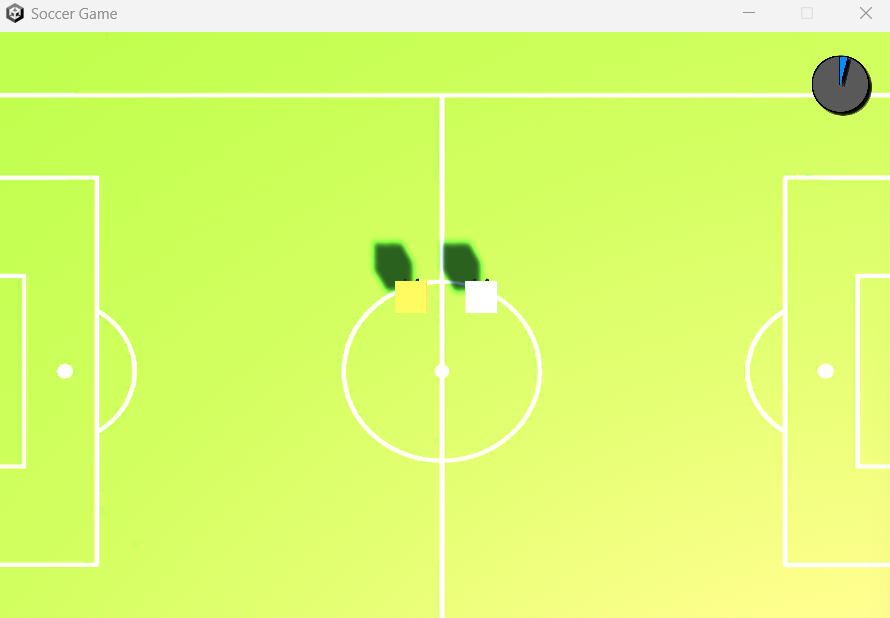

# Multiplayer Soccer Game
### Unity Netcode — Real-Time Multiplayer Synchronization

> Developed as a technical foundation exercise for multi-user synchronization in Unity, prior to building a Digital Twin simulation for fire evacuation research.

---

[](https://youtu.be/DU7YMgwfK4A)


---

## Overview

A real-time multiplayer soccer game built with Unity Netcode for GameObjects. Players control block-shaped characters and compete to score by hitting a ball into the opponent's goal. The project focuses on **networked physics synchronization**, **game state management**, and **multi-client coordination** — core skills later applied to Digital Twin simulation research.

| Feature | Detail |
|---------|--------|
| Players | Unlimited (Unity Netcode architecture) |
| Characters | Block-shaped avatars |
| Mechanics | Physics-based ball collision |
| Scoring | Real-time score tracking across all clients |
| Sync | Server-authoritative via Unity Netcode for GameObjects |

---

## Background

This project was built at the start of a M.Sc. program as a deliberate stepping stone. The goal was to gain hands-on experience with Unity's multiplayer stack before applying the same synchronization principles to a more complex research context: a **multi-user Digital Twin simulation for fire evacuation**, developed in collaboration with NYCU.

Skills transferred from this project to the research:
- Multi-client state synchronization
- Server-authoritative game loop
- Scene and object lifecycle management across networked instances

---

## Tech Stack

| Layer | Technology |
|-------|-----------|
| Engine | Unity 2022 |
| Networking | Unity Netcode for GameObjects |
| Physics | Unity PhysX (Rigidbody sync) |
| Transport | Unity Transport Package |

---

## Quick Start

```bash
# 1. Clone the repository
git clone https://github.com/wenny2377/Multiplayer-Soccer-Game.git

# 2. Open in Unity 2022 or later

# 3. Install packages via Package Manager
#    - Netcode for GameObjects
#    - Unity Transport

# 4. Open the main scene and hit Play
#    - One instance acts as Host
#    - Additional instances connect as Clients
```

---

## Author

**Hui-Hsin Huang**
M.S. Candidate, Computer Science — National Cheng Kung University
Email: wenny2377@gmail.com
GitHub: [wenny2377](https://github.com/wenny2377)
